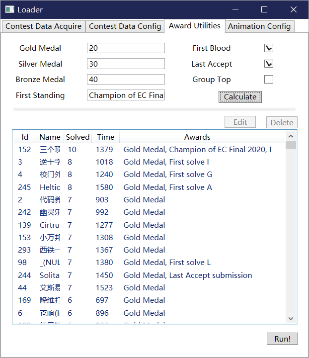
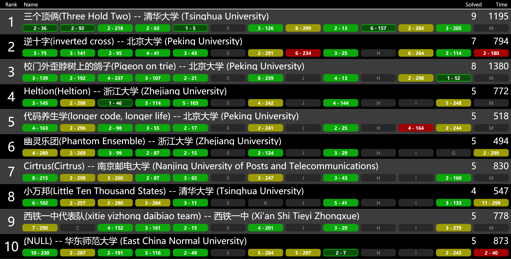

# ICPC Revolver Alternative

ICPC's resolver provides scoreboard rolling function for XCPC contest. However, there're full of *weird* bugs and it is not open-sourced. So we will reimplement its function with C# and WPF.

## Demo

* Loader UI - Awards
  


* Scoreboard



## Try it out

Try it out with [event-feed.json](./TestFeeds/Event-Feed.json) file extracted from EC-Final 2020 contest:

1. Download release or Compile from source
2. Load data from domjudge API or select event feed path(e.g. ./TestFeeds/Event-Feed.json)
3. Validate event feed, autofix it(if required), then save as json without(maybe) glitch
4. Load exported data generated in 3.
5. Config award infos in Award Utilities tab and calculate awards
6. Use default animation arguments or edit it in Animation Config tab
7. Run

## TODO

- [ ] Data schema definition (ongoing)
- [ ] Dataloader support
  - [x] Import directly from Domjudge's event feed
  - [x] Import from event feed file
  - [x] Automatically fix invalid items(problems, submissions, teams)
  - [ ] Import from domjudge database
- [ ] Contest config
  - [ ] Confirm contest infos
  - [ ] Edit contest infos(length, freeze length, penalty, name)
- [x] Award utilities
  - [x] Automatically genarate for Medals, First Blood, Last Accept, etc.
  - [x] Mannually delete/edit award infos for team
- [ ] User mannual
- [ ] Add images support

## Data schema

### Status change

Description: Description of the problems status change, listed by teams

Schema ref: [./config/Schemas/StatusChange.json](./config/Schemas/StatusChange.json)

Example:

```json
[
    {
        "TeamId": 1,
        "TeamName": "SampleName",
        "StatusFrom": [
            {
                "Label": "A",
                "Try": 5,
                "Time": 120,
                "Status": "UnAccept"
            }
        ],
        "StatusTo": [
            {
                "Label": "A",
                "Try": 6,
                "Time": 150,
                "Status": "Accept"
            }
        ]
    }
]
```

### Animation Config

see [ResolverConfig.cs](./src/IcpcResolver.Net/Window/ResolverConfig.cs)